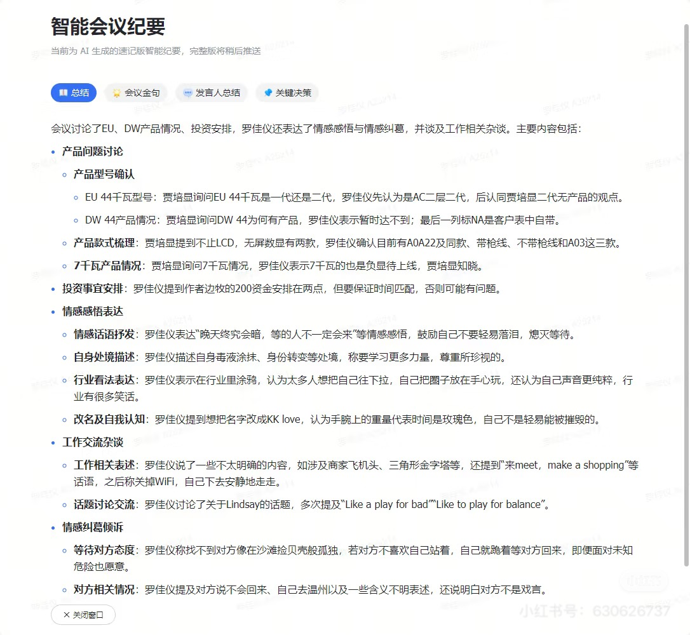
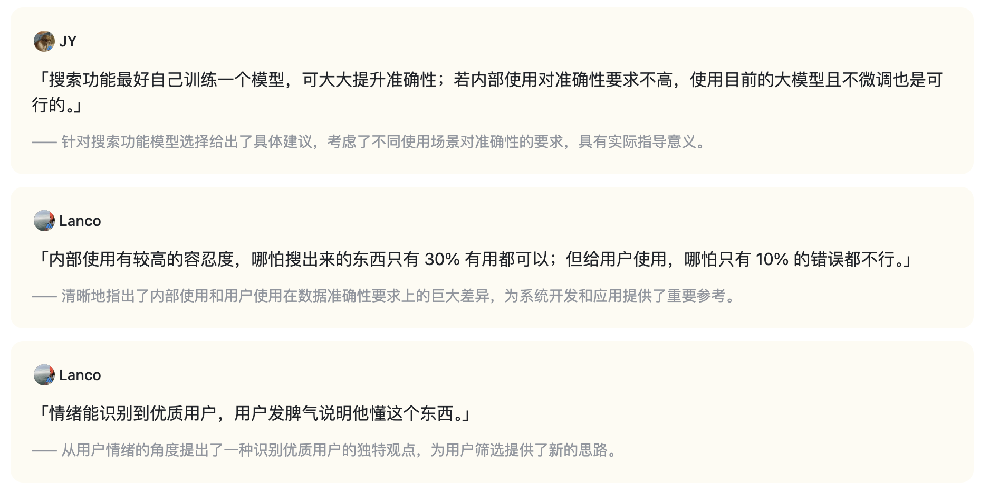
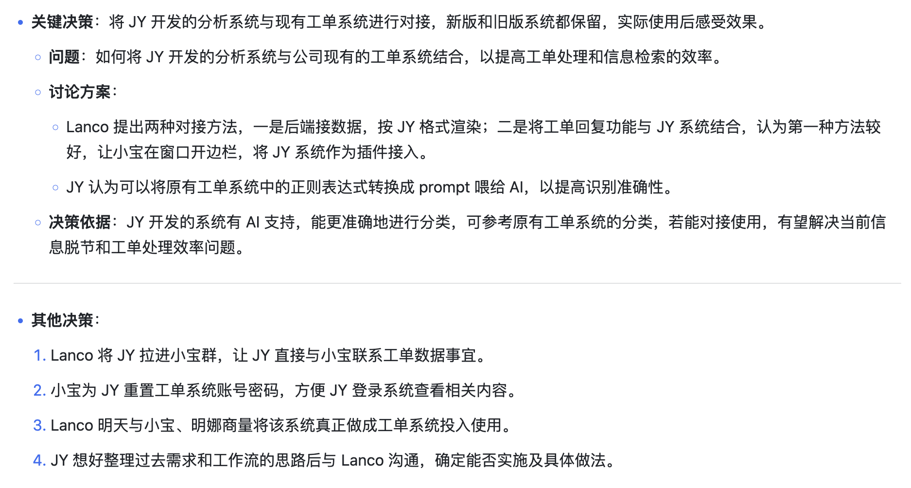

我的最终计划是写一个macOS的app，具体来说，我想推出一个面向个人用户的飞书妙记平替版。现在调用相关的skills，或通过find- skills调用最相关的高价值skills辅助执行任务。根据以下功能描述来构思整体架构，视觉呈现方案，以及prompt设计。具体复刻功能如下：

---

# 飞书妙记 / 智能会议纪要（客户展示版功能框架）

## 1. 智能会议纪要（AI 摘要视图）

### 1.1 总结

- **功能介绍**
  用 AI 对会议内容进行结构化归纳，形成“总体概述 + 分主题要点”的会议总结。官方公开信息明确提到智能会议纪要支持会中实时总结、会后全面回顾，并可自动提炼会议纪要与待办事项。([Lark][1])
- **视觉呈现**
  你提供的截图中，“总结”以顶部标签页（Tab）形式呈现；正文采用分层级的项目符号结构（一级主题、二级子点），便于快速浏览。PDF 导出样例中也呈现为长文版结构化总结。

### 1.2 会议金句（截图可见中的代表性表达/高信息密度语句，并配有简短说明（解释该句的重要性）。此项为你提供的截图中明确可见的功能标签与卡片内容（截图示例中包含引语与一句解释）。

- **视觉呈现**
  卡片式展示：头像 + 发言人姓名 + 引语大字展示 + 下方灰色说明文字。整体偏“引用卡片”样式，适合会后快速传播与复盘重点。

### 1.3 发言人总结（截图可见）

- **功能介绍**
  按发言人维度汇总其观点与发言内容（你提供的截图中该标签页明确存在“发言人总结”）。
- **视觉呈现**
  以标签页形式与“总结/会议金句/关键决策”并列出现，属于同一层级的 AI 纪要视图入口。

### 1.4 关键决策（截图可见）

- **功能介绍**
  将会议中的关键结论整理为结构化决策信息。你提供的截图显示，内容不仅有“结论”，还包含“问题、讨论方案、决策依据”等结构化字段。
- **视觉呈现**
  分块式结构展示：先显示“关键决策”总述，再分层列出“问题 / 讨论方案 / 决策依据”；截图中还出现“其他决策”的编号列表，整体更接近项目复盘/管理视图。

### 1.5 待办事项（官方文档明确）

- **功能介绍**
  Lark 官方帮助中心公开说明 AI Notes 包含 **Action items（待办事项）**；飞书官方产品页也明确提到可自动总结会议纪要与待办。([Lark Suite][2])
- **视觉呈现**
  在你提供的 PDF 导出样例中，“待办”作为独立模块出现，按条目列出事项内容，并包含负责人信息。

### 1.6 智能章节（官方文档明确）

- **功能介绍**
  Lark 官方帮助中心公开说明 AI Notes 包含 **Smart chapters（智能章节）**，用于按时间段切分会议内([Lark Suite][2])
- **视觉呈现**
  在你提供的 PDF 导出样例中，“智能章节”以“时间戳 + 章节标题 + 章节摘要”的形式连续展示（如 00:00、05:21、06:35 等）。

---

## 2. 会议纪要正文（导出文档 / PDF 视图）

> 这一部分不是标签页摘要，而是可归档的“文档化正文”。以下内容均来自你提供的 PDF 样例。

### 2.1 文档头部信息

- **功能介绍**
  在导出正文中展示会议基本信息，便于归档和检索。
- **视觉呈现**
  PDF 样例中头部包含：**文档标题、会议主题、会议时间、参会人、AI 生成免责声明**（“智能会议纪要由 AI 生成，可能不准确，请谨慎甄别后使用”）。

### 2.2 正文总结（长文版）

- **功能介绍**
  将会议内容整理成可阅读的长文纪要，按主题与子主题分层展开。
- **视觉呈现**
  采用层级化项目符号（一级/二级/三级）组织内容；PDF 样例中还可见“来自共享”的图片说明文字（共享内容插入到纪要中）。

### 2.3 待办（正文模块）

- **功能介绍**，便于执行与追踪。
- **视觉呈现**
  PDF 样例中“待办”模块以紧凑条目形式呈现，每条包含任务内容，并附负责人信息（示例中可见人员名称）。

### 2.4 智能章节（正文模块）

- **功能介绍**
  以时间轴方式整理会议进程，帮助快速定位各段讨论主题。
- **视觉呈现**
  PDF 样例中为“时间戳 + 标题 + 摘要”的目录式结构，按会议时间顺序排列。

### 2.5 相关链接（正文模块）

- **功能介绍**
  在纪要文档末尾提供链接入口，关联原始会议记录与文字记 样例末尾显示“相关链接”，包含“妙记（原记录）”和“文字记录”等入口名称。

### 2.6 导出占位模块（正文导出限制提示）

- **功能介绍**
  部分交互类内容在 PDF 导出中不直接展示，会以占位提示形式出现。
- **视觉呈现**
  你提供的 PDF 样例中可见占位文案，例如：
  - “智能纪要权益介绍 [该内容不支持导出查看]”
  - “智能会议纪要反馈收集 [该内容不支持导出查看]”

--能纪要联动）

### 3.1 音视频转文字（妙记基础能力）

- **功能介绍**
  飞书妙记官方公开说明其为音视频转文字工具，可将会议、培训、访谈、课堂等场景内容转为智能文字笔记；产品页与帮助中心均强调“可搜索、可翻译、可协作（评论/@同事）”。([Lark][3])
- **视觉呈现**
  官方公开文案描述为“逐字稿/文字记录”能力；在你提供的 PDF 样例中，“相关链接”里可见“文字记录”入口，体现与纪要正文的联动。

### 3.2 智能会议纪要联动（妙记 -> AI纪要）

- **功能介绍**
  官方公开产品页显示妙记与智能会议纪要联动，可自动生成会议纪要与待办总结；Lark 帮助中心则明确 AI Notes 的核心结构包含 Summary、Action items、Smart chapters。([Lark][3])
- **视觉呈现**
  从你提供的截图与 PDF 样例可见，联动结果至少体现为：顶部 AI 摘要标签页（如总结/会的“总结/待办/智能章节/相关链接”等模块化内容。

### 3.3 分享妙记（官方帮助中心）

- **功能介绍**
  飞书帮助中心公开有“分享妙记”功能说明，且检索摘要显示可“通过智能纪要助手分享”。([Lark][4])
- **视觉呈现**
  该能力属于使用流程与入口能力，通常不在纪要正文中展示为正文内容模块；在产品流程上用于将录制后的妙记/纪要分发给其他成员。

---

# 4. 面向客户的总结（不含技术实现细节）

## 4.1 产品呈现层次（客户可理解）

- **第一层：智能会议纪要（AI 摘要视图）**
  以标签页形式快速阅读核心内容（如总结、会议金句、发言人总结、关键决策等）
- **第二层：会议纪要正文（导出/归档文档）**
  以完整文档形式沉淀会议内容（含元信息、总结、待办、智能章节、相关链接）
- **第三层：妙记原记录（底层逐字稿/录制联动）**
  提供原始会议记录的可搜索文字入口，与智能纪要互相联动

## 4.2 本版说明

[1]: https://www.feishu.cn/product/ai-meeting-summary?utm_source=chatgpt.com "飞书智能会议纪要｜AI 生成纪要，让每场会议都成为数字资产"
[2]: https://www.larksuite.com/hc/en-US/articles/732542328457-generate-ai-notes-for-meetings?utm_source=chatgpt.com "Generate AI Notes for Meetings"
[3]: https://www.feishu.cn/product/minutes?utm_source=chatgpt.com "飞书妙记｜快捷AI 语音识别转文字，会议纪要与待办总结"
[4]: https://www.feishu.cn/hc/zh-CN/articles/749309666122?utm_source=chatgpt.com "分享妙记"

output example:
智能会议纪要：
会议金句：
关键决策：
docs/Legacy/智能纪要：示例集重构-新手任务清单 2026年2月3日.pdf
