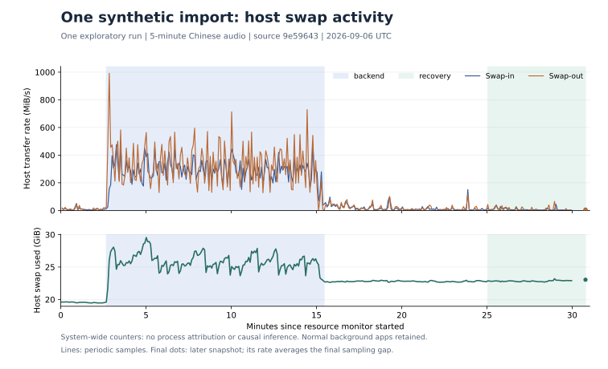

# Issue #6 / YAN-10: one exploratory Import run

Status: **diagnostic evidence only; canonical baseline incomplete; keep YAN-10 open**.

On 2026-09-06, the installed `9e59643` build processed the frozen five-minute
`short-zh` synthetic M4A in **772.498 seconds from queue enqueue to backend
completion**. Native review, saved-record reopening, and Markdown/PDF export
were observed. The transcript loses a decision's negation, and PDF structure
checking reports warnings. This run is preserved but cannot support acceptable
performance or quality conclusions. No optimization or product change is
included in this evidence PR.

## What the timestamps establish

All times below are UTC. This is one run, not a cold/warm cohort or a comparison
with earlier imports. [`runs.jsonl`](./runs.jsonl) retains the individual result
and identifies noncanonical clocks and missing spans.

| Event or envelope | Observed result | Interpretation |
| --- | --- | --- |
| CUA selection click invoked | 01:48:57.554 | Automation invocation, not production action acceptance |
| First captured nonzero progress | 25%, by approximately 01:49:08.051; UI elapsed 0:08, media 5:00 | Derived return bound about 10.50 s after invocation; includes tool overhead |
| Queue enqueue / backend completion | 01:49:04.039235 / 02:01:56.537313 | 772.498078 s by recorded wall clock, not pure ASR RTF |
| Last `transcribing` / first `building_final` poll | 02:01:28.275752 / 02:01:33.281001 | The transition lies between observations, approximately 744.2–749.2 s after enqueue |
| Backend final-building tail | Approximately 23.3–28.3 s | Poll boundary plus backend `ended_at`; includes final generation and Record write |
| Native review capture / matching Record Review | 02:07:10.328 / 02:09:23.612 | Completed states observed after gaps; neither is the exact transition time |
| Native Markdown / PDF exports | Both written, reopened locally and inspected | Accepted-action-to-durable-write spans unavailable |

The approximately five-second job poll began 328.6 seconds after enqueue. It
cannot reconstruct the initial queue, preparation, model load, or early ASR
stages. RPC round trips around the transition samples were below 3 ms; the
table deliberately reports rounded bounds. Pure polling gives a broader
20–30 s final-building interval. Backend timestamps are wall-clock fields;
only resource intervals and polling observations have monotonic clocks.

The longest observed envelope is before `building_final`. The code places
audio preparation, ASR, speaker processing, and transcript ingestion before
that marker, so this evidence cannot rank those components separately. The
import runner writes the Record directly; it does not issue `records.save`.
After backend completion, Swift can request `buildFinal` again while loading
the completed artifacts. That second request is outside the recorded backend
duration and has no measured span here. These are measurement boundaries, not
proven optimization opportunities.

Source references at the measured revision:
[queue timestamps](https://github.com/YannJY02/AutoTranscribe/blob/9e59643a9815a84d787f74fa05df15ee2fd12b02/insightkit/ipc/job_queue.py#L54),
[import runner](https://github.com/YannJY02/AutoTranscribe/blob/9e59643a9815a84d787f74fa05df15ee2fd12b02/scripts/transcription_runner.py#L29),
and [native completion flow](https://github.com/YannJY02/AutoTranscribe/blob/9e59643a9815a84d787f74fa05df15ee2fd12b02/macos/InsightKitApp/Sources/InsightKitApp/ViewModels/ImportSessionViewModel.swift#L529).

## Resource observations



The [sanitized series](./resource-series.csv) contains no process names,
credentials, meeting text, or private Record paths. Rates are differences in
whole-host `vm_stat` counters, not process-specific I/O or added memory use:

```text
MiB/s = (pages_end - pages_start) * 16384 / 1048576
        / (monotonic_end - monotonic_start)
```

| Retained sample window | Sample interval | Host swap-in | Host swap-out |
| --- | ---: | ---: | ---: |
| Before selection, 29 samples | 140.122 s | 9.70 MiB/s | 8.97 MiB/s |
| Inside backend start/end, 154 samples | 767.013 s | 287.85 MiB/s | 329.80 MiB/s |
| After media operations, 61 samples | 344.175 s | 7.14 MiB/s | 7.71 MiB/s |

The backend resource window is 01:49:06.379–02:01:53.368 and omits short gaps
at both job boundaries. Its cumulative swap-in/out is 215.607/247.034 GiB;
these are repeated system-wide transfers, not simultaneous memory occupancy.
The recovery target began at 02:11:27.257, with a five-minute endpoint of
02:16:27.257; the bounded sampler ended shortly before that endpoint.
A final sample at 02:17:13.060 extends the
observation to 345.803 s after the target's start, with a roughly 49 s final
sampling gap. This is not a canonical fixed-window recovery metric.

Two ten-second native `sample` windows captured the same MLX evaluation thread
mostly in condition-variable or GPU-event waits: 909/913 observations early,
907/908 in the middle. These percentages are shares of that thread's sampled
stacks, **not CPU or GPU utilization**. The early/middle samples report
physical footprints of 6.9G/6.1G and peaks of 9.1G in native tool notation.
The separate middle `vmmap` reports 5.1G and a 9.1G peak. Its `unallocated`
summary is anomalous; graphics columns must not be treated as mutually
exclusive values, summed, or converted into attribution percentages.

`ps` RSS uses a different accounting view: sampled backend medians were
36.59 MiB for the app and 33.56 MiB for the sidecar, with maxima of 71.08 and
381.86 MiB. These are not substitutes for MLX physical footprint or GPU
mappings. One sidecar `fluidaudiocli` child was seen near the final transition;
this does not establish its duration or process-spawn count.

**Supported conclusion:** long processing coincided with elevated host paging
and two MLX/Metal waiting-stack observations. GPU execution, process-attributed
paging, and Python phase timings are missing. The capture does not establish
that paging caused the delay, that the GPU was saturated, or which phase
contributed most of the latency.

## Quality and validity

[`quality.json`](./quality.json) records the frozen-reference audit separately
from successful task execution. The saved transcript contains 35 segments and
two speaker labels. The source media is 300.000 s; transcript timestamps span
2.000–297.885 s, and metadata uses the transcript endpoint as its duration.
The protocol has no predetermined CER threshold; error rate alone is not a
quality pass.

CER is 3.6% (27/750 characters) after NFC normalization and removal of Unicode
punctuation and whitespace; without normalization it is 11.829% (97/820).
This normalization recipe was chosen for this exploratory audit and is not
yet frozen in the protocol. All 35 utterances match unique reference time
intervals; their speaker labels agree after one global label permutation.
That sentence-level diagnostic is not frame-level diarization error rate.
Formal JSON Schema validation passes, as do seven nonempty required sections
and consistency among the four saved JSON components. All 14 evidence-range
references resolve to disk transcript segments, but their seven unique ranges
cover only 3/15 expected repeated evidence occurrences. Repeated occurrence
coverage and preservation of the one distinct expected decision/action intent
are separate checks.

The synthetic reference says subsequent runs must **not** temporarily change
the input. All five repeated instances lose that negation in ASR, and the
saved decision instead refers to later handling a department's changes. Its
`needs_review` flag survives into Markdown and PDF as `待复核`, but that flag
does not restore the missing decision. Schema validity and resolvable evidence
links therefore cannot establish semantic fidelity.

Native Record Review reopened the matching saved ID. Its player advanced,
sought to approximately 60% of the media and advanced again. Acoustic output,
a frozen continuous 60-second playback trace, dropped-work count, and a full
media correctness gate were not measured. The persisted package and the later
Import review generation can differ; no cross-generation equality is claimed.

Both exports include the transcript and review markers. All three PDF pages
rendered legibly, but `qpdf --check` exited 3 with object 7/10 offset-zero
warnings. The decisions heading is stranded at the bottom of page 1 and raw
Markdown heading markers remain visible. This is export availability proof,
not a strict PDF or polished-layout pass.

## Evidence boundary and next action

[`manifest.json`](./manifest.json) pins source/build, fixture and reference
hashes, models, profiler limits, and all local raw artifacts. The raw directory
is `logs/diagnostics/performance/20260906/issue-6-short-zh-exploratory-013347`
in the canonical checkout. Raw native captures may include surrounding Record
navigation labels and remain local; none are published in this index.

The app was already open in the current boot. There was no reboot, successful
priming/reset contract, cache purge, or closure of unrelated apps. AC power and
initial nominal thermal state were recorded. Low Power Mode, display,
brightness, and network type were not frozen; continuous thermal/energy and
disk attribution were not captured. `py-spy` could not attach without root,
and noninteractive elevation was unavailable. Its failure is retained. The
resource sampler initially probed the CLI socket; only the separate poll of
the verified installed-app socket supplies job state.

The next bounded action is minimal, job-correlated monotonic timing around
preparation, model initialization, transcription, speaker processing, final
generation, Record commit, and the native completion request, validated before
another exploratory run. Preserve the negation failure as a quality case and
recheck it with any later model change. Do not change model quality, infer a
performance budget, or choose an optimization from the present correlation.
All remaining fixtures, the required cold/warm matrix, canonical spans, and
quality gates remain open under YAN-10.
